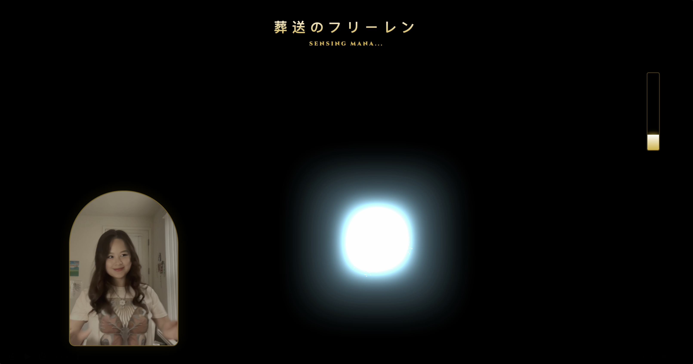
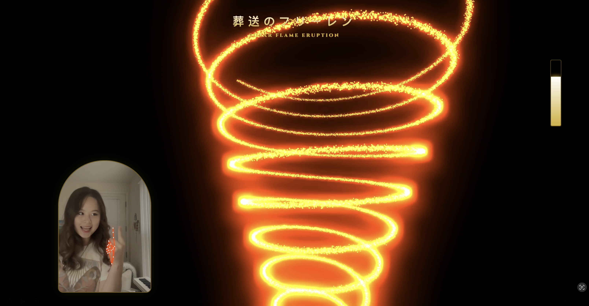
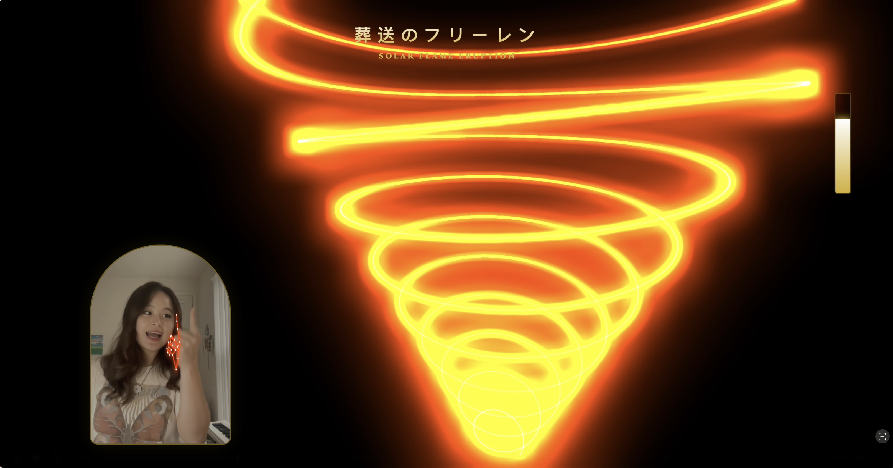
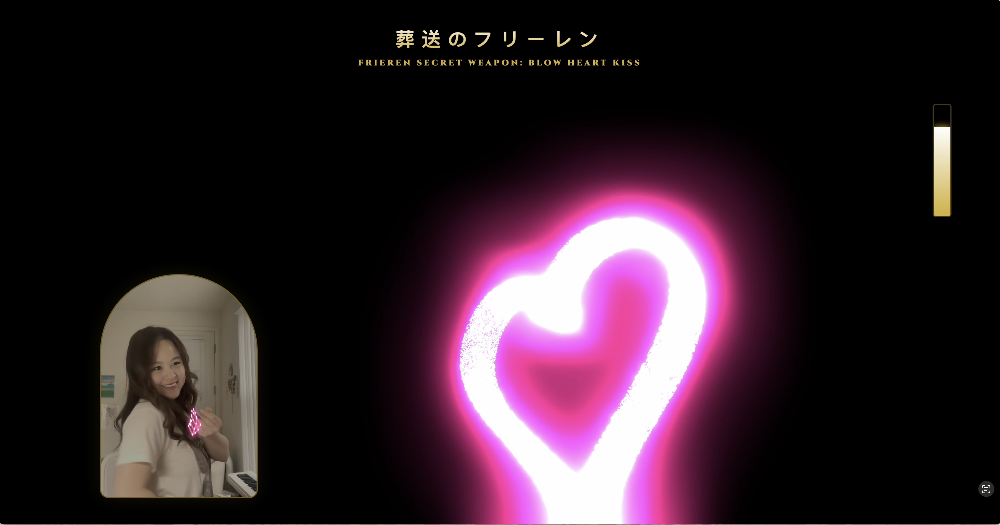
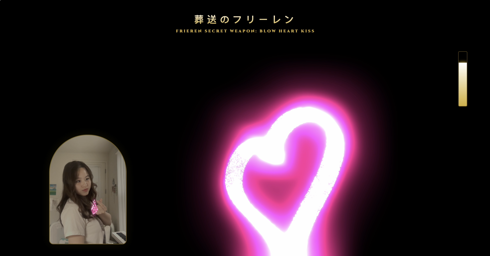
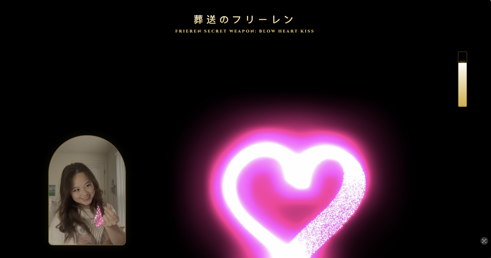

# 葬送のフリーレン (Sousou no Frieren) — Mana Particle Visualization
Code and design by Amy Ouyang.

An immersive, real-time Computer Vision application that allows users to manifest iconic magic from the anime *Frieren: Beyond Journey's End*. Using **MediaPipe Hand Tracking** and **Three.js**, the program translates physical hand gestures into complex 50,000-particle mathematical visualizations.

I love this anime, highly recommend to anyone interested in the philosophy of life and what truly matters from the perspective of an immortal. And anyone who likes art, fantasy, and ethereal, Celtic folk music.

## ✨ Features

* **Real-time Gesture Recognition:** Leverages MediaPipe to detect finger counts, palm spread, and specific hand shapes.
* **Dynamic Particle Physics:** 50,000 individual particles rendered with `THREE.Points` and hardware-accelerated via WebGL.
* **Post-Processing Bloom:** Cinematic glow effects using `UnrealBloomPass` to mimic the ethereal feel of "Mana."
* **Adaptive UI:** The Japanese title and "Mana Meter" respond in real-time to the intensity and nature of the cast magic.

## 🔮 Magic Spells & Hand Gestures

| Spell/Technique Name | Visual Description | Gesture Requirement |
| :--- | :--- | :--- |
| **Sensing Mana** | Neutral teal particle cloud | Default / No hand detected |
| **Blow Heart Kiss** | Pink heart-shaped throb | Finger Heart (Thumb/Index touching) |
| **Solar Flame Eruption** | Spiraling orange solar flares | One finger pointed up |
| **Zoltraak Fracture** | Crystalline blue crystalline array | Four fingers pointed up |
| **Abyssal Reach** | Deep purple void particles | Closed fist |
| **Eldritch Rune Gate** | Pink/Gold pillars and circular gate | Two hands touching (index tips) |
| **Field of Light Flowers** | Expansive gold/white burst | Two hands spread wide |

---

## 📸 Screenshots + Visualization Gallery (all references to the anime!)

| Mana Sensing & Basic State | Solar & Flame Magic | Abyssal & Void |
| :---: | :---: | :---: |
|  <br> *Sensing Mana (Neutral)* |  <br> *Solar Flame Eruption* |  <br> *Abyssal Reach* |
|  <br> *Mana Resonance* |  <br> *Solar Flame (Side View)* |  <br> *Void Compression* |

| Eldritch Rune Gates | Frieren's Secret Weapon | Zoltraak & Flower Fields |
| :---: | :---: | :---: |
|  <br> *Rune Gate Activation* |  <br> *Blow Heart Kiss* |  <br> *Zoltraak Crystalline* |
|  <br> *Circular Rune Geometry* |  <br> *Heart 2* |  <br> *Crystal Fracture* |
|  <br> *Himmel's Gate* |  <br> *Heart 3* |  <br> *Field of Flowers made of light* |

---

## 🛠️ Tech Stack

* **Frontend:** HTML5, CSS3 (Cinzel Web Font)
* **3D Engine:** [Three.js](https://threejs.org/)
* **Computer Vision:** [Google MediaPipe Hands](https://google.github.io/mediapipe/solutions/hands.html)
* **Post-Processing:** UnrealBloomPass (Three.js Add-on)

## 🚀 How to Run Locally

1.  Clone the repository:
    ```bash
    git clone [https://github.com/your-username/frieren-cv-magic.git](https://github.com/your-username/frieren-cv-magic.git)
    ```
2.  Since the project uses ES Modules via `importmap`, you need to serve the file from a local server.
    * **Using VS Code:** Right-click `index.html` and select **"Open with Live Server"**.
    * **Using Python:** Run `python -m http.server` in the project directory.
3.  Allow Camera permissions in your browser.
4.  Perform gestures to start visualizing mana!

## 📜 License
Code by Amy Ouyang. This project is for fan-use and educational purposes. Inspired by the work of Kanehito Yamada and Tsukasa Abe.
